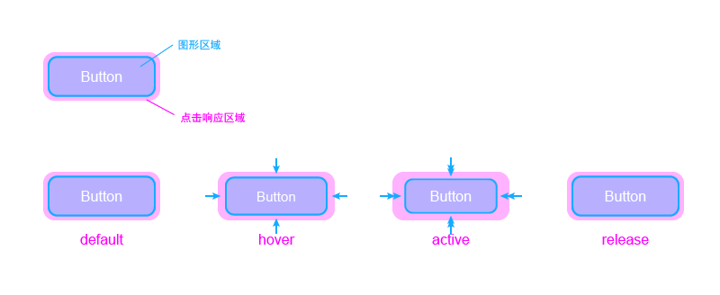

# 按钮组件

## 设计原则

1. 按钮在不同的状态下有不同的显示状态，希望模拟出海绵被按压的感觉。当鼠标指针位于按钮上方的时候，按钮会稍稍向内收缩。当鼠标移开时，恢复到原来的状态。当鼠标按下时，按钮进一步向内收缩，此时释放鼠标按键，按钮回复到原始的状态。
2. 响应区域扩大，按钮的响应区域应比按钮的图形显示区域稍大，这样用户在按钮附近点击时，按钮也可以捕获到用户的点击动作。



在线演示： [Storybook -- Feat Button](https://feat.github.io/button/)

## 安装与使用

安装

```
npm install @featui/button
```

调用

```
import { Button } from '@featui/button';

// import '@featui/button/dist/feat-button.min.css'; // 样式引入
// 也可以使用在原始的scss文件上进行定义

function Example() {
  <Button size='sm' type='primary'>
    Primary
  </Button>
}

```

## 按钮类型

- Button
- SquareButton

## Button PropTypes

| Property | Type   | Required? | Description                                                         |
| :------- | :----- | :-------: | :------------------------------------------------------------------ |
| type     | string |           | `default`, `primary`, `danger`, `link`, `merge`, 默认为： `default` |
| size     | string |           | `sm`, `md`, `lg`, 默认值为：`sm`                                    |
| hitSlop  | number |           | 扩大按钮响应区域, 默认为：`5`                                       |
